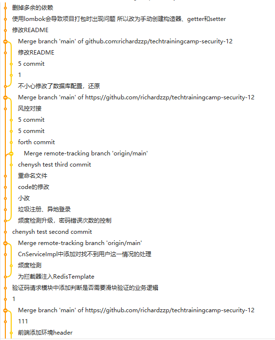

# 抓到你了——具备安全防护能力的账号系统

## 团队成员

曾鹏程、陈雨生、陈诺、廉建华、孙博文

## 前端简介

前端项目存放在frontend文件夹中，采用vue.js框架进行编写，包含系统常用的登录、注册、验证码等功能，首页可以查看用户的登录记录

## 前端技术

| 技术           | 说明               | 官网                                           |
| -------------- | ------------------ | ---------------------------------------------- |
| Node.js        | JavaScript运行环境 | https://nodejs.org/                            |
| Vue.js         | 前端框架           | https://cn.vuejs.org/index.html                |
| Element UI     | 组件库             | https://element.eleme.io/                      |
| fingerprintjs2 | 设备指纹采集器     | https://github.com/fingerprintjs/fingerprintjs |
| axios          | http库             | http://www.axios-js.com/                       |
| Vue-Router     | 路由管理器         | https://router.vuejs.org/                      |

## 前端运行

```shell
cd frontend
npm i      #安装依赖
npm run serve
```

## 后端简介

后端项目存放在backend文件夹中，主要使用Spring Boot框架。

## 后端技术

| 技术        | 说明             | 官网                                           |
| ----------- | ---------------- | ---------------------------------------------- |
| Spring Boot | 容器+MVC框架     | https://spring.io/projects/spring-boot         |
| MyBatis     | ORM框架          | http://www.mybatis.org/mybatis-3/zh/index.html |
| Redis       | 分布式缓存       | https://redis.io/                              |
| HikariCP    | 数据库连接池     | https://github.com/brettwooldridge/HikariCP    |
| MySQL       | 数据库系统       | https://www.mysql.com/                         |
| jBCrypt     | 加密算法工具库   | https://www.mindrot.org/projects/jBCrypt/      |
| JUnit       | 单元测试框架     | https://junit.org/junit5/                      |

## 后端运行

```shell
cd backend
mvn spring-boot:run
```

或者打开IntelliJ IDEA，直接运行项目下的Spring Boot启动类com.catchyou.TechtrainingcampSecurity12Application

## 项目依赖

| 依赖         | 版本   |
| ------------ | ------ |
| JDK          | 8      |
| Spring Boot  | 2.5.6  |
| Apache Maven | 3.8.1  |
| Vue.js       | 2.6.10 |
| MySQL        | 8.0.27 |
| Redis        | 6.2.6  |

## 风控策略

1. 所有请求都会经过拦截器，拦截器会对每个 ip 进行频度检测

   - 同一个 ip 在一个时间片（5s）内只允许请求最多 10 次，如果超过了，就会要求滑块验证，需要用户通过滑块后，前端把请求重新发送一次

   - 如果在 10 分钟内，这个 ip 是第五次触发高频限制了，那么直接锁定这个 ip（这里锁定是通过后端实现的），后续来自这个 ip 的所有请求都将直接打回

2. 密码错误次数过多

   - 连续错误 5 次，1 分钟内不允许再尝试

   - 连续错误 10 次，5 分钟内不允许再尝试

   - 连续错误 15 次，不再允许尝试

3. 垃圾注册
   - 每个设备最多可以注册 5 个账号，若过多则提醒用户注销不常用的账号

4. 异地登录

   - 只有当用户使用密码登录时会进行异地登录的检测

   - 异地登录的定义：首先得是非常用设备，其次得是非常用地址，此时就会触发异地登录，强制要求用户使用手机验证码登录

   - 一次异地登录成功后，地址和 mac 就会被信任，下次登录不会再触发异地

5. 验证码

   - 验证码1分钟只能发送一次

   - 超过3次验证码会出现滑动验证

### 清除封禁

清除封禁的接口：

```
/auth/delete/{username}/{ip}
```

- GET

- 传入用户名和 ip

- 正常清除返回 1，否则返回 0

## 后端API

- 请求和响应数据的格式均为 JSON

- 请求方法为 POST,GET

- 针对所有请求

  - code = 0 通过，返回正常数据

  - Code = 1 请求驳回，返回错误信息

  - code = -1，decisionType=1 请求太频繁，需要滑块验证

  - code = -1，decisionType=3 请求过于频繁，永久封禁

### 账户接口

#### 注册

- URL `/auth/register`

参数：

- username

- password

- phoneNumber

- verifyCode

- environment

  - ip

  - deviceId

返回：

- code = 0，注册成功

- code = 1，因为手机号重复而注册失败;因为验证码不正确而注册失败;因为用户名重复而注册失败;因为由有垃圾注册的嫌疑而注册失败，提醒用户注销部分不常用的账号;后端出现了未知的错误

例如：

```json
// fail
{
    "code": 1,
    "message": "用户名重复了",
    "data": null
}

// succeed
{
    "code": 0,
    "message": "注册成功",
    "data": {
        "expireTime": 0,
        "decisionType": 0,
        "sessionId": "fe98e097-300d-49c1-a62d-6a0643403562"
    }
}
```

#### 通过用户名登录

- URL `/auth/loginWithUsername`

参数：

- username

- password

- environment

  - ip

  - deviceId

返回：

- code = 0，登录成功

- code = 1，因为用户名不存在而登录失败;因为密码错误而登录失败;异地登录，需要强制用户使用手机验证码登录;

- 后端出现了未知的错误

- code = 1，decisionType=2 因为密码 5 次错误，封禁 1 分钟

- code = 1，decisionType=2 因为密码 10 次错误，封禁 5 分钟

- code = 1，decisionType=3 因为密码 15 次错误，永久封禁

示例：

```json
// fail
{
    "code": 1,
    "message": "用户名或密码不正确，登录失败",
    "data": null
}

// succeed
{
    "code": 0,
    "message": "登录成功",
    "data": {
        "expireTime": 0,
        "decisionType": 0,
        "sessionId": "5ab0d7de-ecd1-4c89-86dd-2e4da1e9d82b"
    }
}
```

#### 通过手机号登录

- URL `/auth/loginWithPhone`

参数：

- username

- password

- environment

  - ip

  - deviceId

返回：

- code = 0，登录成功

- code = 1，因为手机号不存在而登录失败;因为验证码错误而登录失败;后端出现了未知的错误

例如：

```json
{     
    "code": 0,     
    "message": "登录成功",     
    "data": {         
        "expireTime": 0,         
        "decisionType": 0,         
        "sessionId": "57026ef5-18f0-4593-bc78-ea18f6215281"     
    } 
}
```

#### 登出

- URL `/auth/logout`

参数：

- ActionType，1代表登出，2代表注销

- sessionId，登录时成功时给出

- environment

  - ip

  - deviceId

返回：

- code = 0，登出成功或者注销成功

- code = 1，注销失败;前端传的 actionType 有问题;后端出现了未知的错误

例如

```json
{     
    "code": 0,     
    "message": "注销成功",     
    "data": null 
}
```

#### 获取登录记录

- URL `/auth/getLoginRecord`

参数：

- sessionId

- environment

  - ip

  - deviceId

返回：

- code = 0，请求成功

- code = 1，后端出现了未知的错误

例如

```json
{     
    "code": 0,     
    "message": "请求成功",     
    "data": [         
        {             
            "id": 31,             
            "uid": "d7bedf61-5646-4aad-b59e-4aa94bdb93c7",             
            "time": "2021-11-01 22:42:49",             
            "ip": "1111",             
            "deviceId": "2222"         
        },         
        {             
            "id": 32,             
            "uid": "d7bedf61-5646-4aad-b59e-4aa94bdb93c7",             
            "time": "2021-11-01 22:43:16",             
            "ip": "xx",             
            "deviceId": "2sss222"         
        }     
    ] 
}
```

#### 获取用户信息

- URL `/auth/getUser`

参数：

- sessionId

- environment

  - ip

  - deviceId

返回：

- code = 0，请求成功

- code = 1，后端出现了未知的错误

例如

```json
{
    "code": 0,
    "message": "请求成功",
    "data": {
        "id": "d7bedf61-5646-4aad-b59e-4aa94bdb93c7",
        "username": "chennuo",
        "phoneNumber": "13391086386",
        "password": "$2a$10$uDjUaRRcOPSZRUV1dEyysemvi.QpS4Nam48ToTe3HgCoN3lZQ8bHy",
        "registerTime": "2021-11-01 22:42:49",
        "registerIp": "1111",
        "registerDeviceId": "2222",
        "isActive": 1
    }
}
```

### 验证码接口

#### 注册请求手机验证码

- URL `/verifyCode/applyCode`

参数：

- phoneNumber: String 手机号

- type: Integer， 1表示登录，2表示注册

- environment
  - ip

- deviceId

返回：

- code =0 ， 请求成功

- code =1 ，手机号不存在、手机号已注册

- code = 1，decisionType=1 需要滑块验证

- code = 1，decisionType=2 请求过于频繁

例如

```json
{
    "code": 0,
    "message": "请求成功",
    "data": {
        "verifyCode": "123456", //6位随机的数字
        "expireTime": "2021-11-01 22:42:49", //验证码过期的时间，例如有效期3分钟，这个时间可以自行设定
        "decisionType": 0
    }
}
```

## 数据库表

我们采用Mysql和Redis进行数据的持久化存储，在Mysql中建立了两张表，一张表存储用户的相关信息，另一张表存储用户的登录信息。Redis主要用来存储手机验证码相关的数据。

### Redis

#### 验证码相关数据

| 键                                 | 值                     | 说明                                                         |
| ---------------------------------- | ---------------------- | ------------------------------------------------------------ |
| verify_code_{手机号}               | 手机验证码             | 记录手机请求的随机验证码，3分钟后失效                        |
| verify_code_limit_{手机号}         | 1                      | 记录下刚进行了验证码请求的手机号，1分钟后失效，用于防止同一个手机号在1分钟内进行多次验证码请求，其值永远为1 |
| verify_code_request_count_{手机号} | 手机号请求验证码的次数 | 记录一个手机号进行验证码请求的累计次数                       |

### MySQL

#### User表

该表存储用户的相关信息

| 名称               | 类型     | 说明       |
| ------------------ | -------- | ---------- |
| id                 | varchar  | 主键,UUID  |
| username           | varchar  | 用户名     |
| phone_number       | varchar  | 手机号     |
| password           | varchar  | 加密密码   |
| register_time      | datetime | 注册时间   |
| register_ip        | varchar  | 注册ip     |
| register_device_id | varchar  | 注册设备号 |
| is_active          | tinyint  | 是否注销   |

#### Log表

该表存储用户的登录信息

| 名称      | 类型     | 说明       |
| --------- | -------- | ---------- |
| id        | int      | 主键,UUID  |
| time      | datetime | 登录日期   |
| ip        | varchar  | 登录ip     |
| device_id | varchar  | 登录设备号 |

## 单元测试

主要使用 SpringBoot 所提供的 SpringBootTest 和 Junit，对每一个接口都进行了测试。

为单元测试实现了如下的 Java 类：

`backend/src/test/java/com/catchyou/TechtrainingcampSecurity12ApplicationTests.java` :

```java
@SpringBootTest
class TechtrainingcampSecurity12ApplicationTests {
    void init();
    /**
     * 登陆时, 手机号存在与不存在两种情况下,申请验证码的功能能否正常实现
     */
    void testApplyCode_1();
    /**
     * 注册时, 手机号存在与不存在两种情况下,申请验证码的功能能否实现
     */
    void testApplyCode_2();
    void testGetLoginRecord();
    void testGetUser();
    /**
     * 验证码正确和错误的情况下, 登录功能能否正常使用
     */
    void testLoginWithPhone();
    void testLoginWithUsername();
    /**
     * 联合logout方法测试
     */
    void testRegister()；
    /**
     * 登出与注销功能能否正确使用
     */
    void testLogout()；
    void testRegisterAndLogout()
}
```

## 代码分支管理

项目采用git进行代码分支管理，开发累计15天，累计提交75次。


